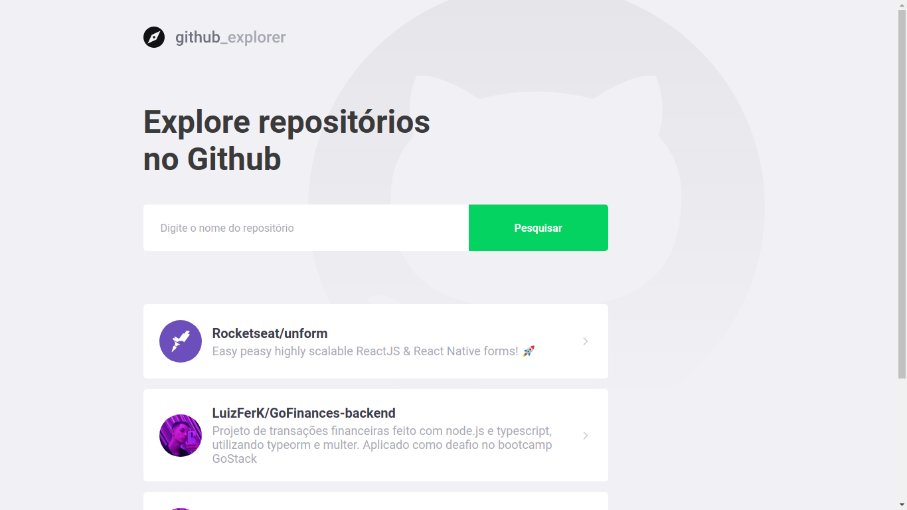
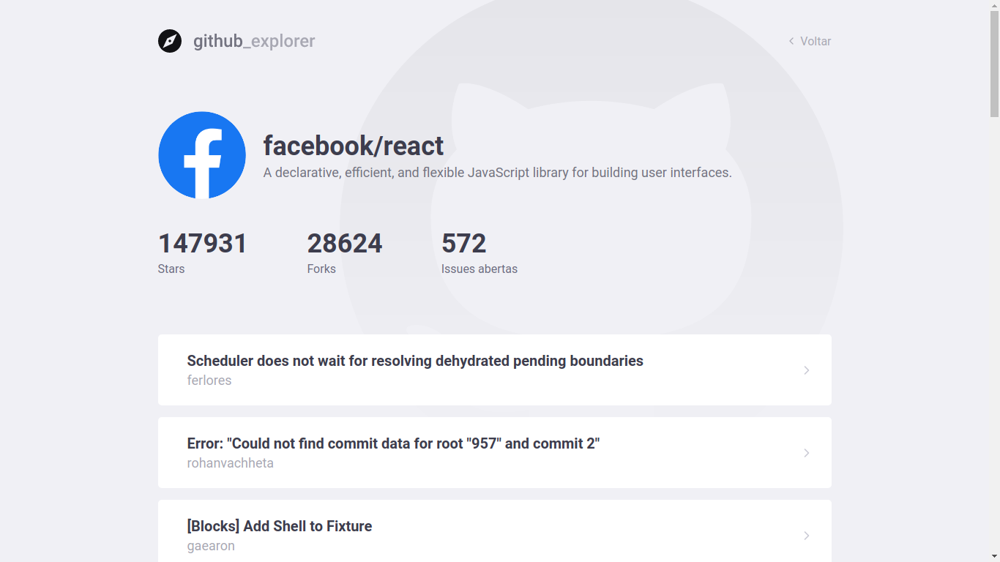

<h1 align="center">
  GitHub Explorer
  <hr />
  
  
  <hr />
	
</h1>
<p align="center">
	The application has been created to show with more clarity to the user your favorite repositories. The clean layout makes an easier view for the users, showing the stars, forks and issues of each repository.
</p>
<h1>Technologies used in this application:<h2>

### GitHub API (api.github.com)
### React.js (WebClient)
- Axios (HTTP Client)
### Styled Components (CSS)

<h1>Get started</h1>

### !!! Yarn required

To start the aplications in your device, first, clone this repository in a new folder. After that, with your terminal, open the folder and run ```yarn```. After the dependeces instalation, run ```yarn start```.

A new tab will be open in your browser with the application.

Now, search the repository name: (example) ```facebook/react```
