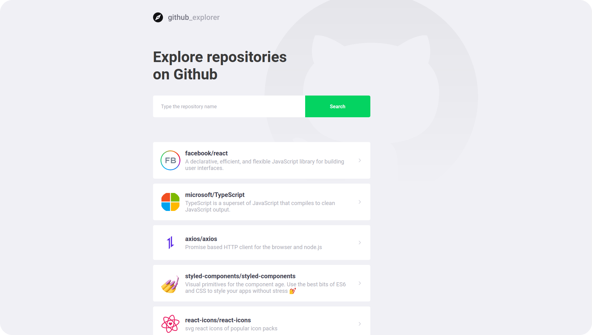
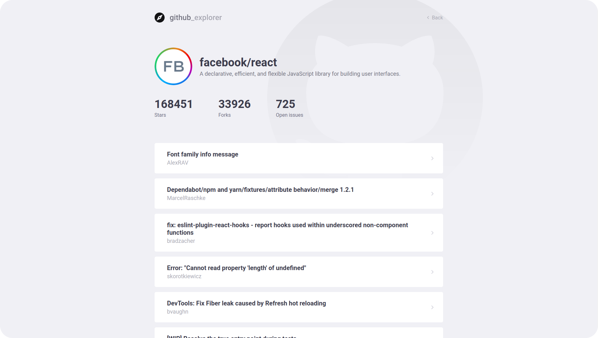

<br />

<p align="center">
  
</p>

<h1 align="center" style="text-align: center;">GitHub Explorer</h1>

<p align="center">
	<a href="https://github.com/LuizFerK">
		
	</a>
	<a href="#">
		
	</a>
	<a href="hhttps://github.com/LuizFerK/GitHubExplorer/stargazers">
		
	</a>
	<a href="https://github.com/LuizFerK/GitHubExplorer/network/members">
		
	</a>
	<a href="https://github.com/LuizFerK/GitHubExplorer/graphs/contributors">
		
	</a>
</p>

<p align="center">
	<b>A clean way to find your favorites repositories on GitHub!</b><br />
  The clean layout makes an easier view for the users, showing the stars, forks and issues of each repository.<br />
	<span>Created with ReactJS and Typescript.</span><br />
	<sub>Made with ❤️</sub>
</p>

<br />




<br />

> # :warning: Note
> This project was made in 2020 with portfolio and study purposes and is no longer in maintenance. The code is under the [MIT license](https://github.com/LuizFerK/GoRestaurant/blob/master/LICENSE), so feel free to clone it and use it the way you want but keep in mind that you probably will need to update some dependencies.
<br />

# :pushpin: Contents

- [Features](#rocket-features)
- [Installation](#wrench-installation)
- [Getting started](#bulb-getting-started)
- [Techs](#fire-techs)
- [Issues](#bug-issues)
- [License](#book-license)

# :rocket: Features

- Clean search for GitHub repositories
- Save your favorites repositories to see them later
- Overview for all information about each repository

# :wrench: Installation

### Required :warning:
- Node.js
- Yarn

### SSH

SSH URLs provide access to a Git repository via SSH, a secure protocol. If you have an SSH key registered in your GitHub account, clone the project using this command:

```git clone git@github.com:LuizFerK/GitHubExplorer.git```

### HTTPS

In case you don't have an SSH key on your GitHub account, you can clone the project using the HTTPS URL. To do it, run this command:

```git clone https://github.com/LuizFerK/GitHubExplorer.git```

**Both of these commands will generate a folder called GitHubExplorer, with all the project**

# :bulb: Getting started

1. Open the folder and run ```yarn``` to install the dependencies
2. Run ```yarn start``` to open the web application on port 3000. (the app will open in your browser automatically)
3. Now, search the repository name: (example) ```facebook/react```

# :fire: Techs

### Typescript (language)

### ReactJS
- Axios
- React Router DOM
- Styled Components

# :bug: Issues

Find a bug or error on the project? Please, feel free to send me the issue on the [GitHub Explorer issues area](https://github.com/LuizFerK/GitHubExplorer/issues), with a title and a description of your found!

If you know the origin of the error and know how to resolve it, please, send me a pull request, I will love to review it!

# :book: License

Released in 2020.

This project is under the [MIT license](https://github.com/LuizFerK/GitHubExplorer/blob/master/LICENSE).

<p align="center">
	< keep coding /> :rocket: :heart:
</p>
